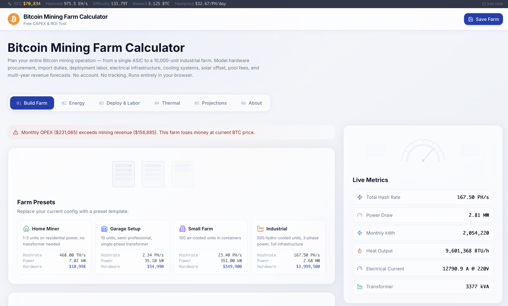

# MineForge — Bitcoin Mining Farm Calculator

**The most comprehensive open-source Bitcoin mining profitability calculator.**

Plan, simulate, and optimize your Bitcoin mining operation — from a single ASIC to a full-scale farm with solar, cooling, and multi-year forecasting.

🌐 **Live:** [bitcoinminingfarmcalculator.com](https://bitcoinminingfarmcalculator.com)



---

## Features

### Farm Builder
- **50+ real ASIC miners** — Bitmain, MicroBT, Canaan, Goldshell, and Ebang with verified specs (hashrate, power, efficiency, price, degradation curves)
- Add/remove miners with per-model quantity controls
- Choose between rack-mount or container infrastructure
- Automatic parasitic load calculation (fans, networking, lighting)

### Electrical Planning
- Auto-sized transformer selection based on total kVA demand
- Copper cable cost calculator (length, gauge, price/kg)
- Smart detection of high-amperage circuits (>20A @ 220V threshold)
- Internal wiring and electrical panel cost estimation
- Noise level calculator for regulatory compliance

### Cooling System
- **Air cooling** — industrial exhaust fan sizing with airflow (m³/h), noise, and cost
- **Dry cooler / hydro cooling** — 26 dry cooler models with full specs (capacity, flow rate, pressure drop, deployment hours)
- Automatic cooler selection based on heat load
- Location-aware ambient temperature via interactive map (Leaflet)
- Ventilation calculations with real thermodynamic formulas

### Solar Simulation
- Panel count, area, and installed kW calculations
- Configurable panel wattage, efficiency, and sun hours
- Effective solar coverage percentage of total farm power
- Cost estimation for solar installation

### Forecasting Engine
- Multi-year profitability projections (1–10 years)
- BTC price scenarios with Stock-to-Flow model integration
- Network difficulty and hashrate growth modeling
- Hardware degradation curves (year 1, 2, 3+ rates per miner)
- Mining pool payout scheme comparison (PPS, PPLNS, FPPS, PPS+)
- Interactive charts with Recharts (revenue, costs, cumulative profit, BTC accumulation)

### Real-Time Dashboard
- Live Bitcoin network stats (hashrate, difficulty, block height, mempool)
- Hashprice display (USD/TH/day)
- Total farm metrics: hashrate, power draw, daily/monthly revenue, electricity cost
- Profitability traffic light indicator
- CAPEX breakdown with donut chart

### Cost Analysis
- Electricity cost calculator from monthly utility bill
- Import taxes and customs duties (configurable per country)
- Labor costs (installation, maintenance, management)
- Complete CAPEX vs OPEX breakdown
- Break-even timeline calculation

### Save & Share
- Save farm configurations to Supabase (no account required)
- Shareable read-only links for collaboration
- Farm presets and quick-start templates
- Export to PDF

---

## Tech Stack

| Technology | Purpose |
|---|---|
| [Next.js 15](https://nextjs.org/) | React framework (App Router) |
| [TypeScript](https://www.typescriptlang.org/) | Type safety |
| [Tailwind CSS](https://tailwindcss.com/) | Styling |
| [Supabase](https://supabase.com/) | Database (Postgres) |
| [Recharts](https://recharts.org/) | Charts and data visualization |
| [React Flow](https://reactflow.dev/) | Flow diagrams |
| [Leaflet](https://leafletjs.com/) | Interactive maps |
| [Zustand](https://zustand-demo.pmnd.rs/) | State management |
| [Vercel](https://vercel.com/) | Deployment |

---

## Getting Started

### Prerequisites

- Node.js 18+ 
- npm 9+
- A [Supabase](https://supabase.com/) project (free tier works)

### Installation

```bash
git clone https://github.com/marceloceccon/bitcoinmining.git
cd bitcoinmining
npm install
```

### Environment Setup

Copy the example environment file:

```bash
cp .env.example .env.local
```

Fill in your Supabase credentials:

```env
NEXT_PUBLIC_SUPABASE_URL=https://your-project.supabase.co
NEXT_PUBLIC_SUPABASE_ANON_KEY=your-anon-key
```

### Run Development Server

```bash
npm run dev
```

Open [http://localhost:3000](http://localhost:3000).

---

## Supabase Setup

### 1. Create Tables

Run the schema in your Supabase SQL editor:

```bash
# The schema file is at:
supabase/schema.sql
```

This creates:
- `miners` — ASIC database with 50+ pre-populated miners
- `farms` — saved farm configurations
- `dry_coolers` — 26 dry cooler models with full specifications
- `air_fans` — industrial exhaust fan data

### 2. Row-Level Security (RLS)

Enable RLS on the `farms` table and add these policies:

```sql
-- Allow anyone to read farms (for shared links)
ALTER TABLE farms ENABLE ROW LEVEL SECURITY;

CREATE POLICY "Allow public read" ON farms
  FOR SELECT USING (true);

CREATE POLICY "Allow public insert" ON farms
  FOR INSERT WITH CHECK (true);
```

The `miners`, `dry_coolers`, and `air_fans` tables need public SELECT access:

```sql
ALTER TABLE miners ENABLE ROW LEVEL SECURITY;
CREATE POLICY "Allow public read" ON miners FOR SELECT USING (true);

ALTER TABLE dry_coolers ENABLE ROW LEVEL SECURITY;
CREATE POLICY "Allow public read" ON dry_coolers FOR SELECT USING (true);

ALTER TABLE air_fans ENABLE ROW LEVEL SECURITY;
CREATE POLICY "Allow public read" ON air_fans FOR SELECT USING (true);
```

### 3. Grants

Ensure the `anon` role has the necessary permissions:

```sql
GRANT SELECT ON miners TO anon;
GRANT SELECT ON dry_coolers TO anon;
GRANT SELECT ON air_fans TO anon;
GRANT SELECT, INSERT ON farms TO anon;
```

---

## Environment Variables

| Variable | Description | Required |
|---|---|---|
| `NEXT_PUBLIC_SUPABASE_URL` | Your Supabase project URL | Yes |
| `NEXT_PUBLIC_SUPABASE_ANON_KEY` | Your Supabase anonymous/public key | Yes |

> **Note:** The app includes fallback miner data and works partially without Supabase, but save/load functionality requires a configured database.

---

## Deployment

### Vercel (Recommended)

1. Push your repo to GitHub
2. Import the project in [Vercel](https://vercel.com/)
3. Add environment variables in Vercel dashboard
4. Deploy — Vercel auto-detects Next.js

### Docker

```bash
docker build -t mineforge .
docker run -p 3000:3000 \
  -e NEXT_PUBLIC_SUPABASE_URL=your_url \
  -e NEXT_PUBLIC_SUPABASE_ANON_KEY=your_key \
  mineforge
```

The multi-stage Dockerfile produces a minimal image (~180 MB) using Next.js standalone output. No dev dependencies or source maps in production.

---

## Project Structure

```
├── app/                  # Next.js App Router pages
│   ├── page.tsx          # Main calculator page
│   ├── load/             # Shared farm loading route
│   └── layout.tsx        # Root layout with metadata
├── components/           # React components
│   ├── FarmBuilder.tsx   # Miner selection and quantities
│   ├── EnergyTab.tsx     # Solar simulation
│   ├── ForecastCharts.tsx # Profitability projections
│   ├── TemperatureControl.tsx # Cooling system
│   ├── MetricsDashboard.tsx   # Real-time metrics
│   └── ui/               # Reusable UI primitives
├── lib/                  # Business logic
│   ├── calculations.ts   # Core math (power, cooling, costs)
│   ├── forecasting.ts    # BTC price & profitability models
│   ├── store.ts          # Zustand state management
│   └── supabase.ts       # Database client
├── types/                # TypeScript interfaces
├── supabase/             # Database schema
└── public/               # Static assets
```

---

## Contributing

Contributions are welcome! See [CONTRIBUTING.md](CONTRIBUTING.md) for guidelines.

---

## License

[MIT](LICENSE) © 2025-2026 Marcelo Ceccon
