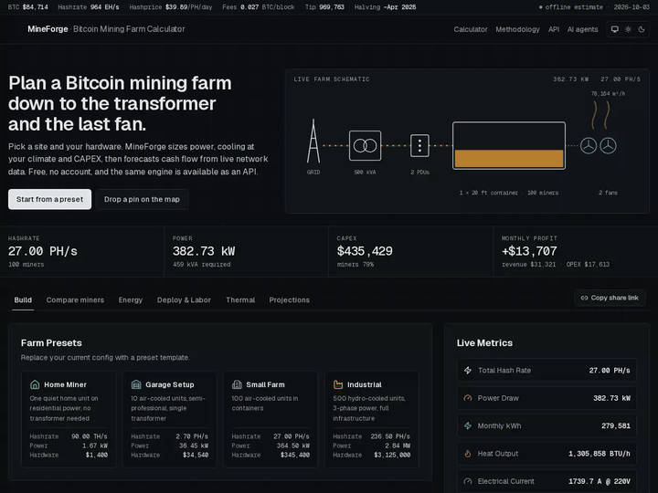

# MineForge · Bitcoin Mining Farm Calculator

**Plan a Bitcoin mining farm down to the transformer and the last fan.** Pick a site and your hardware; MineForge sizes the power and cooling for that site's real climate, itemizes CAPEX and OPEX, and forecasts cash flow from live network data. The same tested engine runs in the browser, behind a free REST API, and as an **MCP server your AI agent can call**.

**Live:** [bitcoinminingfarmcalculator.com](https://www.bitcoinminingfarmcalculator.com) · **For agents:** [/mcp](https://www.bitcoinminingfarmcalculator.com/mcp) · **Methodology:** [ARCHITECTURE.md](ARCHITECTURE.md)



<sub>[MP4](docs/media/demo.mp4) · [WebM](docs/media/demo.webm)</sub>

## What the engine does that other calculators don't

- **Thermal sizing for a real site.** Drop a pin and MineForge pulls a year of ERA5 reanalysis (Open-Meteo): design max temperature and humidity derate dry coolers (−3 %/°C above the 35 °C rating) and set exhaust airflow, then auto-size fans or dry coolers and price them into CAPEX. Hashrate Index, Braiins, WhatToMine, NiceHash and ASIC Miner Value don't do this.
- **Electrical sizing.** Miner count and parasitic load set kW, amps and transformer kVA (single- to three-phase tiers), cabling and breakers.
- **Itemized economics.** 12 CAPEX lines (miners, transformer, racks or containers, cooling, labor, import taxes …) and an itemized OPEX that the forecast reuses.
- **Live-network forecasts.** Revenue is your share of the live network hashrate × (block subsidy + transaction fees); halvings come from block height; network growth defaults to the trailing 12-month trend; the BTC price follows a scenario you choose (flat, ±% per year, or a target) — no Stock-to-Flow.
- **One tested engine, three surfaces.** Pure TypeScript, run in the browser (no calculation requests), by `/api/*`, and by MCP. Golden fixtures pin every number; any change that moves one is explained.
- **Documented.** [ARCHITECTURE.md](ARCHITECTURE.md) gives every formula and its accuracy; [data/README.md](data/README.md) gives every price its source.

## Use it from your AI agent (MCP)

```bash
claude mcp add --transport http mineforge https://www.bitcoinminingfarmcalculator.com/api/mcp
```

Then ask: *"Plan a 1 MW air-cooled farm in Asunción, Paraguay at $0.04/kWh."* Setup for claude.ai, Claude Desktop, Cursor and VS Code is on [/mcp](https://www.bitcoinminingfarmcalculator.com/mcp).

| Tool | What it returns |
|---|---|
| `get_network_stats` | Live market snapshot, hashprice (incl. fees), next halving, trailing hashrate growth |
| `list_miners` / `get_miner` | The ASIC catalog with specs, prices and their sources |
| `compare_miners` | Revenue, power cost and profit per day at your $/kWh; break-even $/kWh, $/TH, payback |
| `calculate_farm` | Power, transformer, cooling for the site, itemized CAPEX/OPEX, spot profit |
| `forecast_farm` | Payback, IRR, NPV, break-even BTC price and yearly cash flow for a price scenario |
| `size_cooling` | Design temperature, derating, recommended dry coolers or fans with CAPEX |

Stateless Streamable HTTP, read-only, no key. Every result echoes the market snapshot and assumptions it used.

## REST API

| Endpoint | Method | Description |
|---|---|---|
| `/api/calculate` | POST | CAPEX, OPEX, cooling and spot revenue for a farm config (`market` overrides optional) |
| `/api/forecast` | POST | Multi-year forecast with price scenarios; echoes its assumptions |
| `/api/miners` | GET | ASIC catalog with price provenance |
| `/api/dry-coolers`, `/api/air-fans` | GET | Cooling catalogs |
| `/api/network` | GET | Live BTC price, hashrate, tip height, fees, hashprice, next halving |
| `/api/updates` | GET | When each catalog was last refreshed |

Interactive reference: [/api-docs](https://www.bitcoinminingfarmcalculator.com/api-docs) · OpenAPI: [/openapi.json](https://www.bitcoinminingfarmcalculator.com/openapi.json). Rate limit: 60 requests/minute per IP for external callers (best-effort, per serverless instance); the site's own UI gets 600/minute.

## Data

90 SHA-256 miners (current Bitmain, MicroBT, Canaan and Bitdeer units, home miners such as Bitaxe and Avalon Q, and repriced legacy units). Each row records `price_basis` (new, used or index), `price_as_of`, `price_source` and `spec_source`. Prices are refreshed quarterly; see [data/README.md](data/README.md).

## Development

Prerequisites: Node.js 22+ and pnpm (`corepack enable pnpm`; the version is pinned in `package.json`).

```bash
git clone https://github.com/marceloceccon/bitcoinmining.git
cd bitcoinmining
pnpm install
pnpm dev                     # http://localhost:3000

pnpm lint && pnpm typecheck && pnpm test && pnpm build
pnpm test:e2e                # Playwright: light, dark, reduced-motion and mobile, incl. axe
pnpm test:golden:update      # re-capture golden fixtures after an intended engine change
```

No database or environment variables are required. See [tests/README.md](tests/README.md) for what each suite covers and [CONTRIBUTING.md](CONTRIBUTING.md) to contribute.

## Tech stack

Next.js 15 (App Router), React 19, TypeScript, Tailwind CSS (token-based design system), Zustand, Recharts, Leaflet, motion, Vitest, Playwright + axe, `mcp-handler` + `@modelcontextprotocol/server`, `next-openapi-gen`. Deployed on Vercel.

## Privacy

No accounts. No cookies. Anonymous page analytics only (Vercel Analytics). Calculations run in your browser; the UI only fetches the live market snapshot, and your farm configuration is never sent or stored (it's kept in your own browser's local storage, or in a share link you create).

## License

MIT
